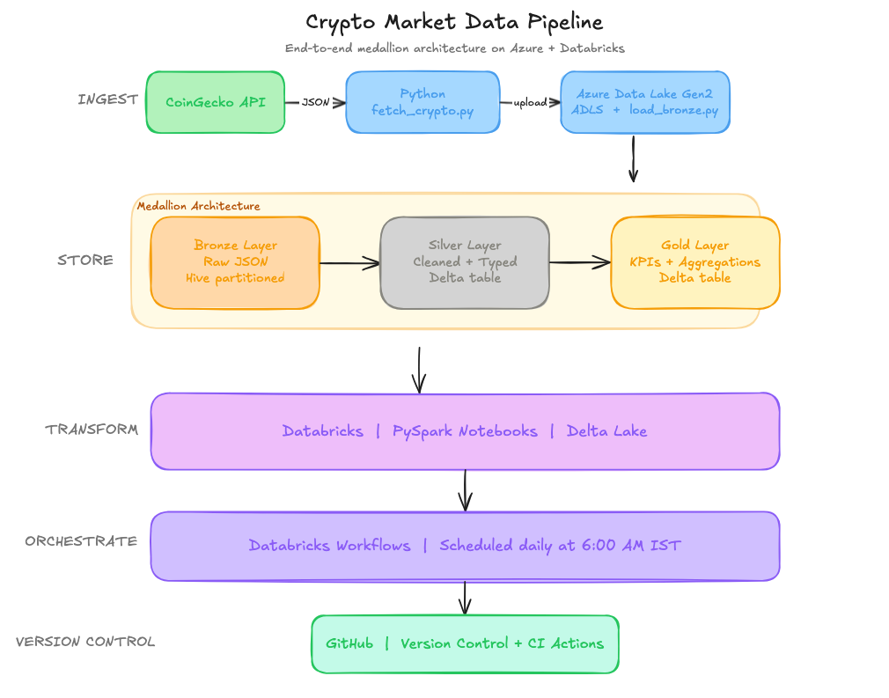

# Crypto Market Data Pipeline

An end-to-end automated data pipeline that ingests real-time cryptocurrency market data, transforms it using PySpark on Databricks, and stores it in Azure Data Lake Gen2 following the medallion architecture.

---

## Architecture



---

## Tech Stack

| Layer | Tool |
|---|---|
| Data Source | CoinGecko Public API |
| Ingestion | Python, Requests |
| Raw Storage | Azure Data Lake Gen2 |
| Transformation | Apache Spark, PySpark |
| Storage Format | Delta Lake |
| Orchestration | Databricks Workflows |
| Version Control | GitHub + GitHub Actions |

---

## Medallion Architecture

- **Bronze** — Raw JSON data ingested from CoinGecko API, stored as-is with Hive partitioning (`year/month/day`)
- **Silver** — Cleaned, typed, and deduplicated data stored as Delta table
- **Gold** — Aggregated KPIs including top 10 coins by market cap, top 5 gainers and losers, and overall market summary

---

## Pipeline Flow

```
CoinGecko API
      ↓
fetch_crypto.py      → pulls top 100 coins with price, volume, market cap
      ↓
load_bronze.py       → uploads raw JSON to Azure Data Lake (Bronze)
      ↓
01_bronze_to_silver  → cleans, casts types, deduplicates → Silver Delta table
      ↓
02_silver_to_gold    → aggregates KPIs → Gold Delta tables
      ↓
Databricks Workflows → runs full pipeline daily at 6:00 AM IST
```

---

## Project Structure

```
crypto-pipeline/
├── ingestion/
│   ├── fetch_crypto.py        # Fetch top 100 coins from CoinGecko API
│   └── load_bronze.py         # Upload raw JSON to Azure Data Lake Bronze layer
├── notebooks/
│   ├── 01_bronze_to_silver.py # PySpark transformation: Bronze → Silver
│   └── 02_silver_to_gold.py   # PySpark aggregation: Silver → Gold
├── assets/
│   └── architecture.png       # Architecture diagram
├── pyproject.toml
└── .gitignore
```

---

## Setup

### Prerequisites
- Python 3.11+
- uv package manager
- Azure account with Data Lake Gen2 storage
- Databricks workspace on Azure

### Local Setup

```bash
git clone https://github.com/YOUR_USERNAME/crypto-pipeline
cd crypto-pipeline
uv sync
```

### Environment Variables

Create a `.env` file in the root:

```env
AZURE_STORAGE_CONNECTION_STRING=your_connection_string
AZURE_CONTAINER_NAME=bronze
```

### Run Ingestion Locally

```bash
python ingestion/fetch_crypto.py
python ingestion/load_bronze.py
```

### Databricks Setup

1. Create a Databricks secret scope named `crypto-pipeline`
2. Add `storage-account-name` and `storage-account-key` secrets
3. Import notebooks from the `notebooks/` folder
4. Create a Workflow with `01_bronze_to_silver` → `02_silver_to_gold`
5. Schedule daily at your preferred time

---

## Gold Layer Outputs

| Table | Description |
|---|---|
| `top10_by_marketcap` | Top 10 coins ranked by market cap |
| `top5_gainers` | Biggest 24h price gainers |
| `top5_losers` | Biggest 24h price losers |
| `market_summary` | Total market cap and volume |

---

## Key Concepts Demonstrated

- Medallion architecture (Bronze → Silver → Gold)
- Hive partitioning for efficient data lake queries
- Delta Lake for ACID transactions and schema enforcement
- PySpark transformations and aggregations
- Cloud secret management with Databricks secret scopes
- Pipeline orchestration and scheduling with Databricks Workflows

---

## Future Improvements

- Add dbt transformations on top of Gold layer
- Build a Streamlit dashboard for live visualization
- Add data quality checks with Great Expectations
- Extend to multiple cryptocurrencies and historical data
- Set up alerting on pipeline failures via email or Slack
